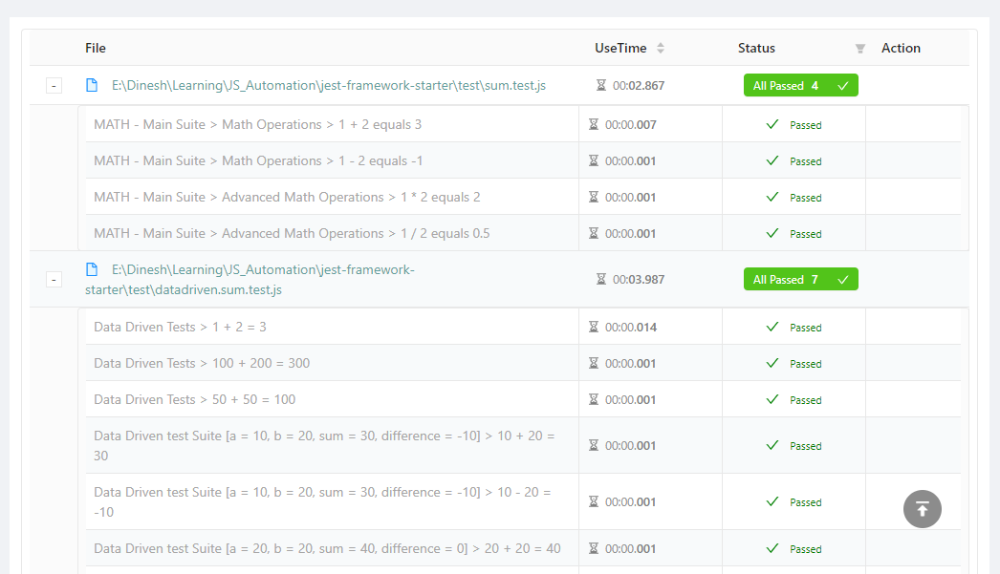
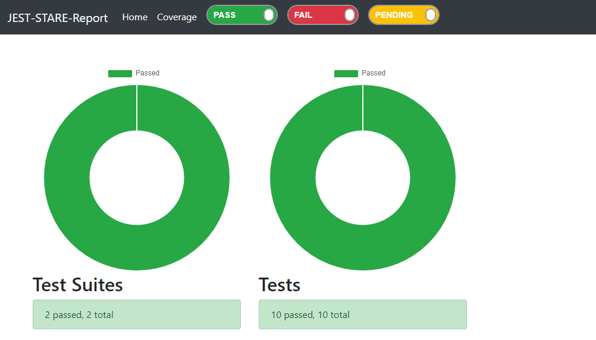
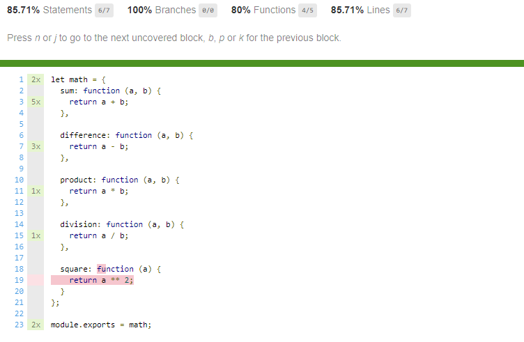

# jest-framework-starter
(As per the Jest website) Jest is a delightful JavaScript Testing Framework with a focus on simplicity.

I have created this project as a starting point for those who want to use Jest for functional test automation. 

If you are planning to use Jest in your testing work, this project will surely give you a good head-start.

# So, what is jest-framework-starter?
This is a Test Automation Framework with a lot of important features already built-in.
## It's preconfigured
It comes with a jest config file that has a lot of settings already configured. This means, you can use it as-is or  customize it further as per your needs. see the central jest config file [here](jest.config.js).

## Global Setup & Teardown scripts
Under the [testconfig](testconfig) folder, there are `global_setup` and `global_teardown` scripts. They run only once for entire set of tests that get executed. You may add global-level setup and teardown code here. To begin with, these scripts only print the colorful messages on the console.

## Global Variables
[Jest Config](jest.config.js) file has a section where global variables can be defined. See a sample Global variables section below.
```javascript
   globals: {
      __APP_NAME__: 'MATH',
   }
```
The variable `__APP_NAME__` can be directly used in the test script as shown below.

```javascript
// __APP_NAME__ value is set in the jest.config.js under the Globals section
let appName = __APP_NAME__;

// parent test suite
describe(`${appName} - Main Suite`, () => { 

...

});
```
One use of global variables is to store application and environment details like application URLs, port numbers, API end points.

## HTML Reports
I have configured 3 different HTML reports in the framework. The configuraton is available in the [Jest Config](https://github.com/dineshvelhal/jest-framework-starter/blob/master/jest.config.js) file under the `reporters` key. Based on your liking you may choose to use any one of them (or all, if you are inclined to do so 😊).
### Reports screenshots
#### JEST-HTML-Reporter

#### JEST-HTML-Reporters


#### JEST-STARE Reports



## Coverage Report
Test coverage is by default enabled in the config file. The framework generates coverage reports in multiple formats. (It also shows coverage report and summary on the console output.). All coverage reports are available under the `coverage` sub-folder. 

_**Bonus feature - 1**_ - A detailed coverage report is available in a colorful format as part of the JEST-STARE HTML reports. See the `Coverage` link at the top in the screenshot above.



_**Bonus feature - 2**_ - the coverage report is also available in a colorful format in the Jenkins UI, when the tests are run through Jenkins CI builds. More on this in the following sections.

## Jenkins CI Integration
The framework comes with a sample [Jenkinsfile](Jenkinsfile) that can be use to setup a basic Pipeline with test step. The Jenkinsfile executes below steps during the build operation.
- Runs `npm install` to download and install the dependencies
- Runs `npm test` to execute the jest tests
- Runs post steps to
   - read the junit.xml and generate report in the Jenkins project
   - read the coverage xml to generate the Cobertura coverage report
See the Jenkins Coverage report below.


## References
- [Jest Home](https://jestjs.io/en/)
- [Jest on Wikipedia](https://en.wikipedia.org/wiki/Jest_(JavaScript_framework))
